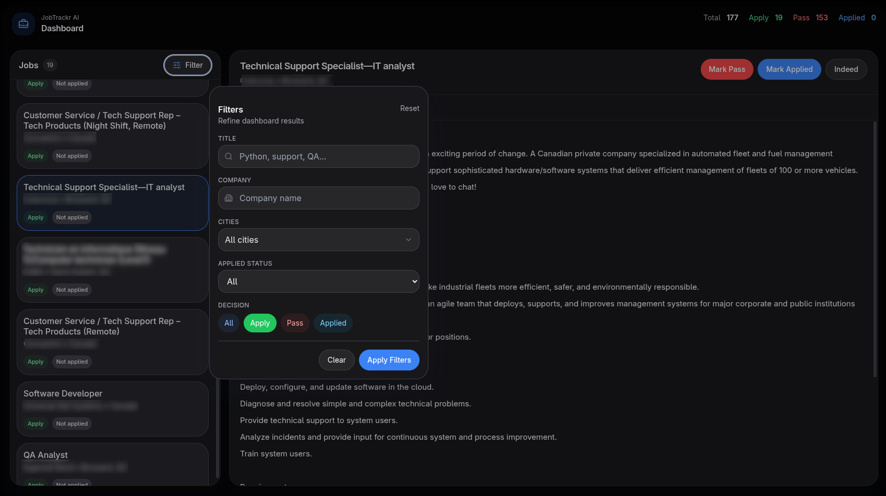

# JobTrackr-AI


JobTrackr-AI is a local-first job search assistant that automates job discovery, enriches listings with scraped data, evaluates them with a local LLM, and provides a Flask web interface to review and manage opportunities.

The system is designed for users who want full control over their job-search workflow, data, and evaluation logic without relying on external SaaS platforms.

---

## Overview

JobTrackr-AI combines automated job discovery, scraping, AI evaluation, and a web dashboard into a single Python application.

The system periodically searches job listings based on user-defined criteria, collects job details, evaluates them using a locally running LLM via Ollama, and stores results in a SQLite database. The web interface allows users to browse, filter, and manage tracked opportunities.

Everything runs locally.

---

## Features

* Automated job discovery using configurable keywords, locations, search radius, and LLM model
* Selenium + BeautifulSoup pipeline for scraping listings and job details
* AI-powered job evaluation using a configurable local LLM through Ollama
* SQLite database managed with SQLAlchemy
* Flask web interface for reviewing and managing job listings
* Background search scheduler for periodic updates
* Job deduplication using platform job IDs
* Persistent state tracking to prevent redundant runs
* Immediate job processing pipeline (scrape → evaluate → save)

---

## Interface

Example dashboard view:



---

## How It Works

Each search cycle follows a streaming pipeline:

1. Launch Selenium with Chrome
2. Load an authenticated browser session using exported cookies
3. Search for jobs using configured keywords, locations, and radius
4. For each job listing:

   * extract listing metadata
   * open the job detail page
   * scrape description, skills, and job type
   * evaluate the job using the configured LLM
   * store the result in the database
5. Continue through remaining listings and pages
6. Update the last run timestamp

Jobs are processed one at a time to ensure each result is immediately saved.

---

## Tech Stack

* Python
* Flask
* SQLAlchemy
* SQLite
* Selenium
* BeautifulSoup4
* Ollama
* Local LLMs

---

## Project Structure

```text
JobTrackr-AI/
├── main.py
├── requirements.txt
├── app/                      # Flask application
├── core/                     # Core application logic
│   ├── job_finder.py         # Selenium scraping pipeline
│   ├── llm_evaluator.py      # LLM classification logic
│   └── job_database.py       # SQLAlchemy job repository
├── user/
│   ├── cookies/              # Exported browser cookies
│   │   └── cookies.json
│   ├── search_config.json    # Search configuration
│   └── state.json            # Last run timestamp
└── data/                     # Optional runtime data
```

---

## Requirements

* Python 3.10 or newer
* Google Chrome browser
* ChromeDriver compatible with your Chrome version
* Ollama installed locally
* At least one Ollama model pulled locally

Chrome is required because Selenium controls a real Chrome instance for scraping and authenticated sessions.

---

## Installation

### 1. Clone the repository

```bash
git clone https://github.com/C47HERINE/JobTrackr-AI.git
cd JobTrackr-AI
```

### 2. Create a virtual environment

```bash
python -m venv .venv
source .venv/bin/activate
```

Windows:

```bash
.venv\Scripts\activate
```

### 3. Install dependencies

```bash
pip install -r requirements.txt
```

### 4. Install Ollama

Download and install Ollama:

[https://ollama.com/download](https://ollama.com/download)

Then pull the model you want to use in `user/search_config.json`, for example:

```bash
ollama pull gemma3:12b
```

---

## Exporting Chrome Session Cookies

Some job platforms limit access to job details or apply stricter rate limits to unauthenticated users. JobTrackr-AI can reuse your authenticated browser session by loading cookies from Chrome.

### 1. Install a Chrome cookie export extension

Install **Get cookies.txt LOCALLY**:

[https://chrome.google.com/webstore/detail/get-cookiestxt-locally](https://chrome.google.com/webstore/detail/get-cookiestxt-locally)

Any extension capable of exporting cookies as JSON will work.

### 2. Log into the job platform

Open Chrome and sign into the job platform you want to scrape.

Example:

[https://indeed.com](https://indeed.com)

Make sure you are fully logged in and able to view job listings normally.

### 3. Export cookies

1. Click the cookie export extension icon
2. Export cookies for the current site
3. Save the file in JSON format

### 4. Place the cookies file in the project

Move the exported file to:

```text
user/cookies/cookies.json
```

Example:

```text
user/
├── cookies/
│   └── cookies.json
```

At runtime the scraper will load these cookies into the Selenium session to replicate your logged-in browser state.

---

## Configuration

Create or edit:

```text
user/search_config.json
```

Example:

```json
{
  "keywords": ["python", "machine learning", "data scientist"],
  "locations": ["Montreal", "Longueuil", "Brossard"],
  "radii": [25],
  "llm_model": "gemma3:12b"
}
```

Field descriptions:

* `keywords` – job search terms
* `locations` – search locations
* `radii` – search radius values
* `llm_model` – Ollama model used for job evaluation

The application also stores the timestamp of the last successful run in:

```text
user/state.json
```

Example:

```json
{
  "last_run": 0
}
```

---

## Running the Application

Start the system:

```bash
python main.py
```

At startup the application will:

1. Load search configuration
2. Launch the background job search loop
3. Scrape and evaluate jobs
4. Save results to SQLite
5. Start the Flask web interface

The web interface will be available at:

```text
http://127.0.0.1:5000
```

---

## Job Data Stored

Each job record may include:

* Job ID
* Title
* Company
* Job URL
* Location
* City
* Job type
* Skills extracted from the page
* Full description
* AI decision (`apply`, `pass`, or `error`)
* AI reasoning
* Timestamp
* Application status

---

## Roadmap

Planned features include:

* Interview tracking dashboard
* LLM-assisted CV generation for selected jobs
* Mock interview support
* Improved filtering and search tools
* Automated application workflows
* User authentication and multi-user support
* Settings interface for search configuration
* AI chat assistant for job-search guidance

---

## Status

This project is actively under development.

The current version already supports:

* automated job scraping
* LLM evaluation
* persistent storage
* local web interface for review

Additional features and UI improvements are planned.

---

## License

MIT License

See the `LICENSE` file for details.

---

## Author

Created by **C47HERINE**

[https://github.com/C47HERINE](https://github.com/C47HERINE)
